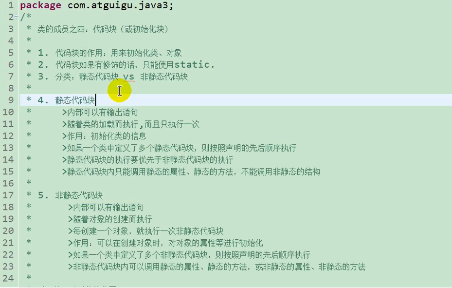
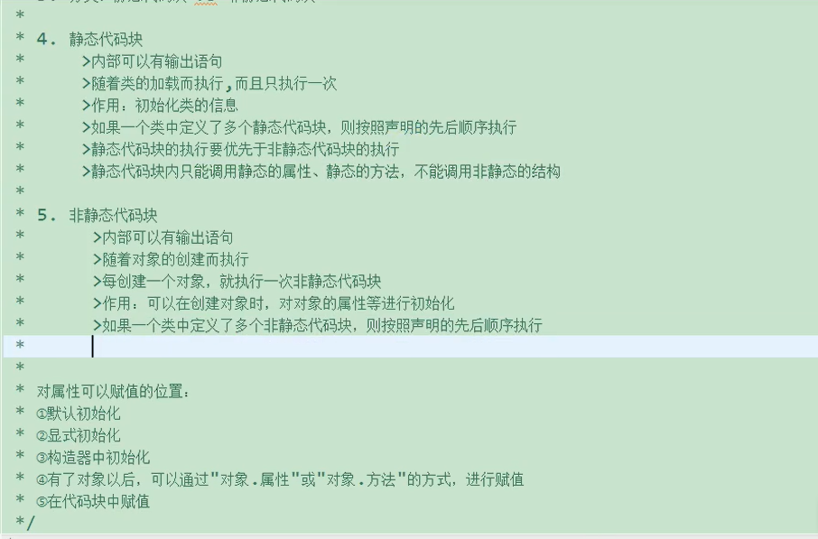

# **代码块**
## **1. 概念**
>
>  

- ### **实例化对象时，涉及到父类、子类中静态代码块、非静态代码块、构造器的加载顺序："由父及子，静态先行"！**

## **2. 实现**
``` java
在类的构造器和方法之间  
使用{}即可创建  
①：static{}  //跟随类的加载而加载
②：{}   //跟随类的实例化而加载

        //代码块的执行要先于构造器
```
 ## **3. 可以对属性赋值的位置(按照先后顺序)**
> - 默认初始化
> - 显示初始化/在代码块中赋值(两者看先后位置顺序)
> - 构造器中初始化
> - 有了对象以后，可以通过"对象.属性"或"对象.方法"的方式，进行赋值

# **final类**
1. final可以用来修饰的结构：类、方法、变量。
2. final用来修饰一个类：此类不能被其它类继承。
3. final用来修饰方法：表明此方法不能被重写
4. final用来修饰变量：此时的“变量”就成为是一个常量 【变量包括属性和局部变量(形参和定义在方法中定义的变量)】

# **接口**
## 接口的使用
**1. 用interface来定义**
``` java
    interface Flyable{

    }
    class plant extends Object implements Flyable{      
    //可以先用extends继承父类，然后再用implemens来实现接口
    //若有多个接口则各个接口名字间以逗号隔开。
        
    }
```
**2. Java中接口和类是并列的两个结构**  
**3. 如何定义接口：定义接口中的成员**  
- JDK7及以前：只能定义全局常量和抽象方法  
    &nbsp; 全局常量：public static final。但是书写时可以省略不写  
    &nbsp; 抽象方法：public abstract
- JDK8：除了定义全局常量和抽象方法之外，还可以定义静态方法、默认方法

``` java
public interface CompareA{
    //静态方法，与抽象方法不同的是静态方法中有方法体，但是调用静态方法必须通过接口来调用。即：接口名.静态方法
    public static void method1(){
        System.out.println("北京");
    }

    //默认方法:关键字：default
    //通过实现类的对象(实例化类的对象),可以调用接口中的默认方法！
    //如果实现类重写了接口中的默认方法，调用时仍然调用的是重写以后的方法
    public default void method2(){
        System.out.println("上海");
    }

    //知识点3：如果子类（或实现类）继承的父类和实现类的接口中声明了通冥瞳参数的方法，那么子类在没有重写此方法的情况下，默认调用的是’父类‘中同名参数的方法。---类优先原则


    //知识点4：如果实现类实现了多个接口，而这多个接口中定义了同名同参数的默认方法（default）那么在实现类中没有重写此方法的情况下，报错。--->接口冲突        这就需要我们重写此方法。
}
```

**4. 接口中不可以定义构造器，即接口不可以实例化**  
**5. Java开发中，接口通过让类实现的方式去使用。**  
- 如果实现类覆盖了接口中的所有抽象方法，则此类可以实例化。
- 如果实现类没有覆盖接口中的所有抽象方法，则此类仍为一个抽象类。 
 
**6. Java类可以实现多个接口 ———>弥补了Java单继承性的局限性**
- 格式：class AA extends BB implements CC,DD,EE

**7. 接口与接口之间可以继承，而且可以多继承**  
**8. 接口的具体使用，体现了多态性**  
**9. 接口，实际上可以看作是一种规范**

# **类的内部成员之五：内部类**
### **1.类的内部成员：属性、方法、构造器、代码块、内部类**
``` java
package InnerClassTest;
/*
 * 类的内部成员之五：内部类
 * 1.Java中允许将一个类A生命在另一个类B中，则类A就是内部类，类B称为外部类
 * 
 * 2.内部类的分类：成员内部类（静态、非静态）vs 局部内部类（方法内、代码块内、构造器内）
 * 
 * 3.成员内部类
 * 		一方面，作为外部类的成员
 * 			> 可以调用外部类的结构
 * 			> 可以被static修饰(正常外部类不能被static修饰。static只能修饰外部类的属性、方法、代码块)
 * 			> 可以被四种不同的权限修饰
 *		
 * 		另一方面，作为一个类
 * 			> 类内可以定义属性、方法、构造器等
 * 			> 可以被final修饰，表示此类不能被继承，言外之意，不适用final，就可以被继承
 * 			> 可以被abstract修饰（抽象类：表示此类不能被实例化）
 * 
 * 4.关注三个问题
 * 4.1 如何实现实例化成员内部类的对象
 * 4.2 如何在成员内部类中区分调用外部类的机构
 * 4.3 开发中局部内部类的使用
 * 
 */
public class InnerClassTest {
	
	public static void main(String[] args) {
		//创建静态成员内部类的实例化对象
		Person.Dog dog1 = new Person.Dog(); 	
		dog1.show();
		
		//创建Bird实例（非静态的成员内部类）
//		Person.Bird bird1 = new Person.Bird();	//错误的
		
		Person p = new Person();
		Person.Bird bird1 = p.new Bird();
		bird1.sing();
	}
}

class Person{
	
	String name;
	int age;
	public void eat() {
		System.out.println("人可以吃饭");
	}
	
	//静态成员内部类
	static class Dog{
		String name;
		int age;
		
		public void show() {
			System.out.println("卡拉是条狗");
//			eat(); //Dog类为静态类 只能调用静态的属性和方法
		}
	}
	
	//非静态成员内部类
	final class Bird{
		private String  name;
		
		public Bird(){
			
		}
		
		public void sing() {
			System.out.println("我是一只鸟");
			Person.this.eat(); //调用外部类的非静态属性
		}
	}
	
	public Person(){
		//声名在构造器中的类
		class CC{
			
		}
	}
	
	public void method() {
		//局部内部类
		//声明在方法体中
		class AA{
			
		}
	}
	
	{
		//声明在代码块中
		class BB{
		}
	}
	
}
```
``` java
⭐抽象类和接口有哪些共同点和区别？
相同点： 1.不能被实例化 
         2.都可以被继承
不同点：1.抽象类：有构造器  接口：不能声明构造器 
        2.接口可以多继承，抽象类只能单继承
        3.接口关键词：interfac抽象类关键词：abstract
        4.接口中属性只能为静态属性
```

